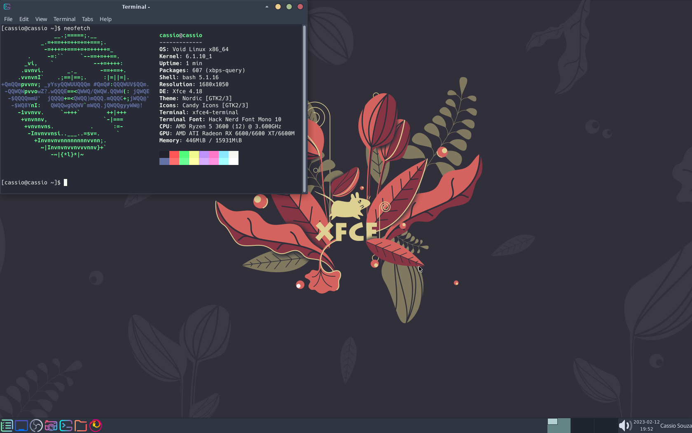
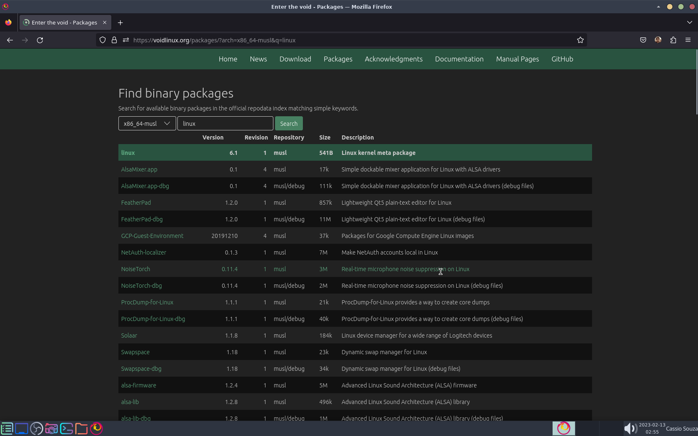
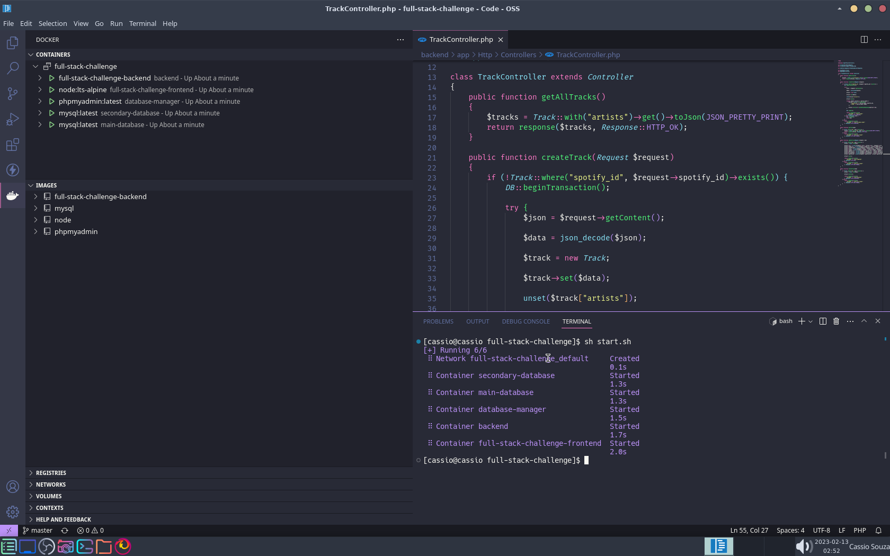
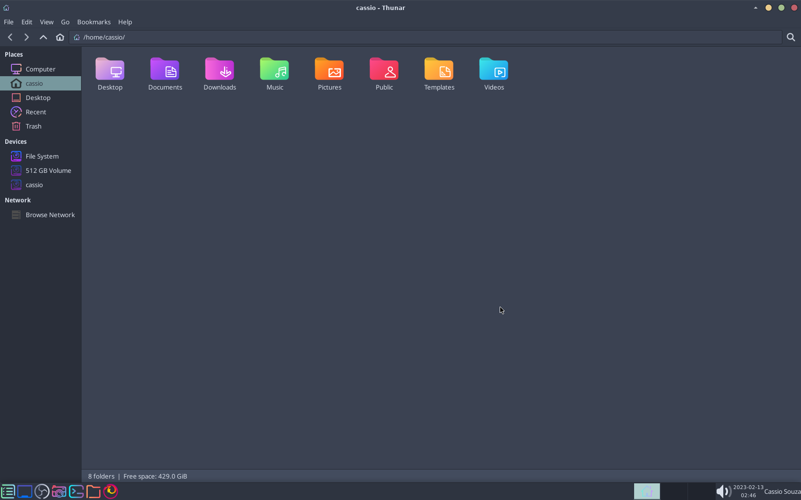
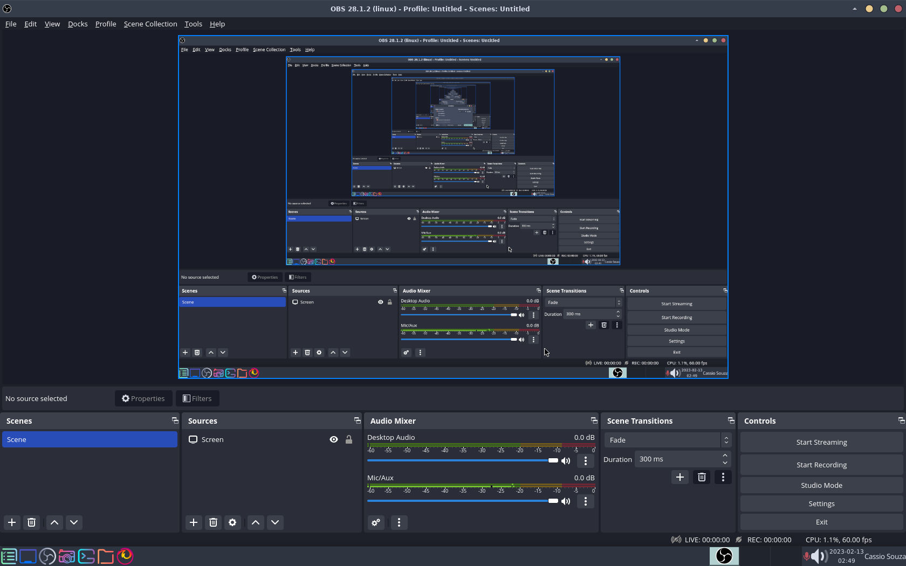

<h1 align="center">
  Void Linux XFCE4 Themes and Config
</h1>

<h4 align="center">My custom themes, config and programs on Void Linux XFCE4</h4>

<p align="center">
  <a href="#about">About</a> •
  <a href="#features">Features</a> •
  <a href="#usage">Usage</a> •
  <a href="#screenshots">Screenshots</a> •
  <a href="#credits">Credits</a> •
  <a href="#license">License</a>
</p>



## About

After some time using Void Linux, I installed some custom themes config and user configs for some essential programs like Wireplumber and Chrony. And now I'm sharing it, feel free to write a issue if you find some problem.

## Features

Besides the default programs and configs on Void Linux XFCE4 image, my custom config includes:

- Themes:
  - [Nordic Theme](https://github.com/EliverLara/Nordic)
  - [Candy Icons](https://github.com/EliverLara/candy-icons)
  - [Dracula Theme](https://github.com/dracula/xfce4-terminal)
- System Info:
  - [Htop](https://github.com/htop-dev/htop)
  - [Btop](https://github.com/aristocratos/btop)
  - [Neofetch](https://github.com/dylanaraps/neofetch)
- Programs
  - [Git](https://github.com/git/git)
  - [Code OSS](https://github.com/microsoft/vscode)
  - [OBS Studio](https://github.com/obsproject/obs-studio)
  - [Docker and Docker Compose](https://github.com/docker)
- Multimedia
  - [xfce4-pulseaudio-plugin](https://gitlab.xfce.org/panel-plugins/xfce4-pulseaudio-plugin)
  - [xfce4-screenshooter](https://gitlab.xfce.org/apps/xfce4-screenshooter)
  - [Wireplumber](https://gitlab.freedesktop.org/pipewire/wireplumber)
  - [Pipewire](https://gitlab.freedesktop.org/pipewire/pipewire)
- Date and Time
  - [Chrony](https://chrony.tuxfamily.org/)
- [Nerd Fonts](https://github.com/ryanoasis/nerd-fonts)

## Usage

This guide will use Void's package manager commands but this packages should be present in almost all distros.

If you want to install only the themes:

```sh
sudo xbps-install git
```

If you want to install all my programs:

```sh
sudo xbps-install htop btop neofetch git vscode obs docker docker-compose xfce4-pulseaudio-plugin xfce4-screenshooter pipewire wireplumber chrony
```

And make sure your bashrc has:

```sh
###########################
# DEFINE CONFIG BASE PATH #
###########################

export XDG_CONFIG_HOME="$HOME/.config"
```

### Installing Nordic Theme

```sh
git clone https://github.com/EliverLara/Nordic ~/.themes/"Nordic Theme"
```

Now go to XFCE4 Appearence and the theme should be there.

### Installing Candy Icons

```sh
git clone https://github.com/EliverLara/candy-icons ~/.icons/"Candy Icons"
```

Now go to XFCE4 Appearence and the icons should be there.

### Installing Dracula Theme on XFCE4 Terminal

Clone the repository:

```sh
git clone https://github.com/dracula/xfce4-terminal.git
```

Now open the folde and put the file ``Dracula.theme`` on:

```sh
 ~/.local/share/xfce4/terminal/colorschemes
```

### Multimedia

Void Linux XFCE4 comes with pulseaudio, make sure you don't have it:

```sh
sudo xbps-remove pulseaudio
```

This command may result on error if you are using packages with pulseaudio dependency, so uninstall them too.

If you already installed pipewire and wireplumber you can paste [this file](pipewire.conf) on this path:

```sh
~/.config/pipewire/pipewire.conf
```

Now for pipewire to run on startup (if autostart folder does not exist create one):

```sh
ln -s /usr/share/applications/pipewire.desktop ~/.config/autostart/pipewire.desktop
```

### Date and Time

With Chrony already installed just run to enable Crhony service on runit:

```sh
sudo ln -s /etc/sv/chronyd /var/service
```

### Nerd Fonts

For render special emojis, glyphs and characters install the following:

```sh
sudo xbps-install noto-fonts-emoji nerd-fonts
```

This is a huge pack with lots of fonts, pick you most like on XFCE4 Appearence.

## Screenshots



---



---



---



## Credits

Besides the project links already listed on [Features section](#features), I would like to thanks:

- [Void Linux](https://github.com/void-linux)
- [XFCE4](https://gitlab.xfce.org/xfce)

## License

MIT

---

> [Website](https://cassiofernando.netlify.app/) &nbsp;&middot;&nbsp;
> GitHub [@cassiofb-dev](https://github.com/cassiofb-dev) &nbsp;&middot;&nbsp;
> Twitter [@cassiofb_dev](https://twitter.com/cassiofb_dev)
